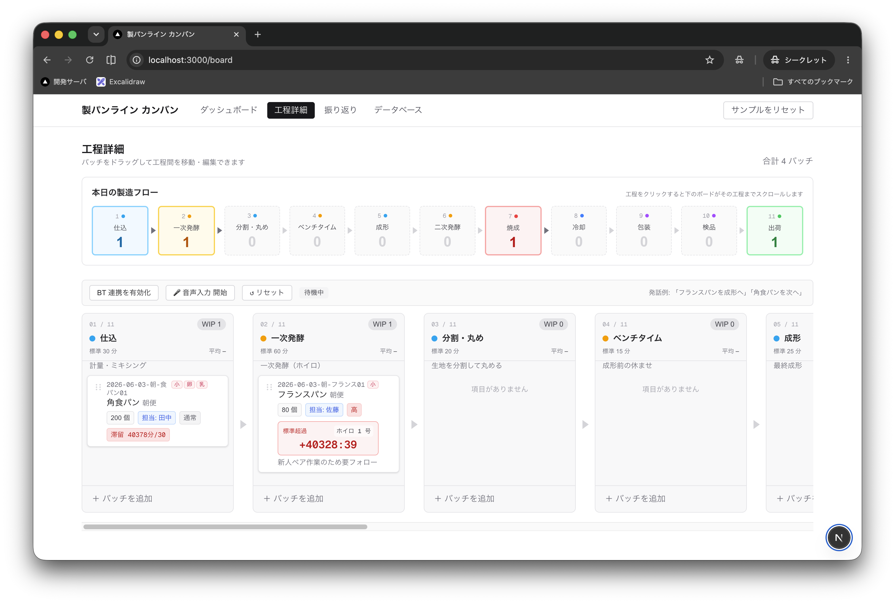

# 製パンライン カンバン

製パン工場の製造ラインを管理する Next.js 製カンバンアプリ。仕込みから出荷までの11工程をバッチ単位でドラッグ&ドロップ管理し、音声操作・Bluetoothイヤホン連携・KPIダッシュボードまで備えたデモ実装です。

- **11工程固定**: 仕込 → 一次発酵 → 分割・丸め → ベンチタイム → 成形 → 二次発酵 → 焼成 → 冷却 → 包装 → 検品 → 出荷
- バッチ（製造ロット）の追加・編集・工程間移動（ドラッグ&ドロップ）
- 工程ごとの標準時間・滞留時間・標準超過アラート表示
- 音声コマンドでバッチを次工程へ移動。文字起こし（Web Speech API / Whisper）・解釈（TypeSafe AI「Jev」/ ローカルLLM）とも切替可能
- Bluetoothイヤホンの物理ボタンで録音開始/停止・リセット（Shokz OpenFit 2+ で動作確認）
- ダッシュボード（本日のKPI・要注意バッチ・製品別/アレルゲン別集計）
- 振り返りKPI（過去7日の出荷数・リードタイム・品質合格率・ボトルネック工程）
- DBインスペクタ（SQLiteの中身をそのまま閲覧）
- サンプルデータをワンクリックで再生成（本番環境ではデフォルト無効）
- データは SQLite ファイル (`prisma/dev.db`) に永続化
- 日本語 UI

## 技術スタック

| 役割 | 採用 |
| --- | --- |
| フレームワーク | Next.js 16 (App Router, Cache Components) |
| 言語 | TypeScript |
| UI | React 19 / Tailwind CSS v4 |
| データ層 | Prisma 7 + SQLite (`@prisma/adapter-better-sqlite3` / `better-sqlite3`) |
| ミューテーション | Server Actions + `updateTag('board')` |
| ドラッグ & ドロップ | `@dnd-kit/core` / `@dnd-kit/sortable` |
| 音声入力（文字起こし） | Web Speech API（既定、Chrome/Safari）/ whisper-server（whisper.cpp、要 `--convert`） |
| 音声入力（解釈） | TypeSafe AI「Jev」（既定）/ ローカルLLM（llama.cpp 等、OpenAI互換API） |
| BT連携・TTS | [`mic-test`](https://github.com/Takashi-Matsumura/mic-test)（GitHub直接依存、Media Session API経由のAVRCP制御） |

## セットアップ

```bash
npm install              # 依存をインストール（postinstall で prisma generate も実行）
npm run db:push          # SQLite DB を作成・スキーマ反映
npm run db:seed          # 11工程・製品・アレルゲン・設備・サンプルバッチをシード
npm run dev              # 開発サーバを起動
```

ブラウザで [http://localhost:3000](http://localhost:3000) を開きます。シードデータは実行日基準で動的生成されるため、いつ実行しても「本日分」のバッチとして表示されます。

### 音声入力を使う場合（任意）

音声コマンドは「文字起こし（発話→テキスト）」と「解釈（テキスト→操作）」の2段階。それぞれ独立して切り替えられます。

#### 文字起こしエンジン

既定はブラウザの Web Speech API（サーバ不要、リアルタイムに文字が表示される）。

[whisper.cpp](https://github.com/ggml-org/whisper.cpp) の `whisper-server` に切り替えると、ブラウザの音声認識より高精度な文字起こしができます（マイク音声をまとめて録音し、停止後にサーバへ送って文字起こしするため、Web Speech API のような逐次表示はありません）。

```bash
brew install whisper-cpp
# モデルは別途用意する（例: ggml-large-v3-turbo-q5_0.bin を ~/.local/share/whisper-models/ 等に配置）
whisper-server -m /path/to/ggml-large-v3-turbo-q5_0.bin --host 127.0.0.1 --port 8090 -l ja --convert
```

`--convert`（ffmpeg 変換、要 `brew install ffmpeg`）はブラウザの `MediaRecorder` が出力する webm/opus 形式を受け付けるために必須です。

```bash
TRANSCRIBE_ENGINE=webspeech      # 既定値。webspeech | whisper で切替
WHISPER_URL=http://localhost:8090 # 既定値。whisper-server のエンドポイント
```

`TRANSCRIBE_ENGINE` はサーバ起動時の既定値。音声操作デモパネルの `Web Speech`/`Whisper` ボタンでリクエスト単位に切り替えることもできる（サーバ再起動不要）。ブラウザ→`/api/transcribe`（Next.js）→`whisper-server` の順に中継し、CORS を回避している。

#### 解釈エンジン

音声コマンドは既定で [TypeSafe AI](https://typesafe.ai) の Jev を使って解釈します。`.env.local` に API キーを設定してください。

```bash
VOICE_ENGINE=jev                # 既定値。jev | llama で切替
TYPESAFE_API_KEY=your-api-key   # https://typesafe.ai で発行したキー
```

`VOICE_ENGINE` はサーバ起動時の既定値。音声操作デモパネルの `Jev`/`llama` ボタンでリクエスト単位に切り替えることもできる（サーバ再起動不要）。

Jev の確信度に応じて挙動が変わります。

| 確信度 | 挙動 |
| --- | --- |
| 85% 以上 | 自動実行 |
| 60〜85% | 確認してから実行（画面の[実行]/[取消]、または BT イヤホンのシングル/ダブルクリック） |
| 60% 未満 | 実行せず「聞き取れませんでした」と表示 |

従来のローカルLLM経路（llama.cpp の `llama-server` など、OpenAI互換 `/v1/chat/completions` を提供するもの）に戻す場合は `VOICE_ENGINE=llama` を設定し、別途 `http://localhost:8080` でサーバを起動してください。この経路には確信度がないため、解釈できれば常に確認なしで即実行します。

```bash
LLAMA_URL=http://localhost:8080          # 既定値。LLMサーバのエンドポイント
LLAMA_MODEL=gemma-4-e4b-it-Q4_K_M.gguf   # 既定値。使用モデル名
```

## スクリプト

| script | 説明 |
| --- | --- |
| `npm run dev` | 開発サーバ起動（Turbopack） |
| `npm run build` | プロダクションビルド |
| `npm start` | プロダクション起動 |
| `npm run lint` | ESLint |
| `npm run db:push` | Prisma スキーマを SQLite に反映 |
| `npm run db:seed` | 工程・製品・アレルゲン・設備・サンプルバッチをシード |

画面右上の「サンプルをリセット」ボタンからも同じシード処理を再実行できます（`POST /api/db-reset`）。本番環境（`NODE_ENV=production`）では `ALLOW_DB_RESET=true` を明示しない限り 403 で拒否されます。

## 画面構成



| パス | 画面 | 概要 |
| --- | --- | --- |
| `/` | ダッシュボード | 本日のKPI、要注意バッチ、製品別/アレルゲン別グラフ、工程フロー |
| `/board` | 工程詳細 | バッチをドラッグ&ドロップで工程間移動。音声入力・BT連携バーもここ |
| `/kpi` | 振り返り | 過去7日の出荷数・平均リードタイム・品質合格率・工程別ボトルネック |
| `/db` | データベース | SQLite の全テーブルを閲覧できるデモ用インスペクタ |

## データモデル（`prisma/schema.prisma`）

| テーブル | 役割 |
| --- | --- |
| `Column` | 工程（11工程固定）。name / stageType / 標準所要時間など |
| `Product` | 製品マスタ（角食パン、フランスパン等） |
| `Allergen` / `ProductAllergen` | アレルゲンマスタと製品の中間テーブル |
| `Equipment` | 設備マスタ（ミキサー、ホイロ、オーブン等） |
| `Card` | バッチ（製造ロット）。製品・設備・数量・担当者・優先度・目標完了時刻など |
| `StageHistory` | 工程ごとの滞留履歴（滞在時間の記録） |
| `QualityCheck` | 品質チェック結果 |

## 音声入力・BT連携の仕組み

1. `useSpeechRecognition`（Web Speech API）で発話をテキスト化
2. `lib/voice-dictionary.ts` で製パン用語の同音異義語誤変換を補正（例: 「整形」→「成形」）
3. `docs/voice/{process.md, glossary.md, examples.md}` の工程マニュアル・用語集・few-shot例を `lib/voice-context.ts` がシステムプロンプトに注入
4. `app/api/voice-command/route.ts` がローカルLLMへ問い合わせ、対象バッチと移動先工程を解決して `moveCard` を実行
5. `mic-test/openfit` の `useOpenFit` がBluetoothイヤホンの物理ボタン（シングルクリック=録音開始/停止、ダブルクリック=リセット）をAVRCP経由で購読し、`mic-test/tts` が結果を読み上げ

## ディレクトリ構成

```
app/
  page.tsx                    # / ダッシュボード
  layout.tsx                  # AppHeader + フォント設定
  actions.ts                  # Server Actions（createBatch, moveCard, addQualityCheck 等）+ updateTag
  board/page.tsx               # /board 工程詳細
  kpi/page.tsx                  # /kpi 振り返りKPI
  db/page.tsx                    # /db DBインスペクタ
  api/
    voice-command/route.ts     # 音声→ローカルLLM解釈API
    db-reset/route.ts          # サンプルデータ再生成API
  _components/
    AppHeader.tsx              # ナビゲーション + サンプルリセットボタン
    Board.tsx                  # DndContext + 音声/BT連携バーの統合
    Column.tsx / Card.tsx      # 工程列 / バッチカード
    CardDetail.tsx              # バッチ詳細（基本/品質/工程履歴/メモの4タブ）
    AddCardForm.tsx
    StageFlow.tsx               # 本日の製造フロー可視化
    StageTimer.tsx               # 標準時間・目標時刻カウントダウン
    DbInspector.tsx               # テーブル一覧表示
    useSpeechRecognition.ts
lib/
  prisma.ts                    # PrismaClient シングルトン（better-sqlite3 アダプタ）
  board.ts / dashboard.ts / kpi.ts / db-snapshot.ts   # 'use cache' + cacheTag('board') のデータ取得
  stage-equipment.ts            # 工程⇔設備種別マッピング
  voice-context.ts / voice-dictionary.ts
docs/voice/                    # 音声LLM用ナレッジ（process / glossary / examples）
prisma/
  schema.prisma                 # データモデル定義
  seed.ts                        # CLIシードエントリ（npm run db:seed）
  seedData.ts                     # 実際のシード処理（実行日基準で動的生成）
prisma.config.ts                # Prisma 7 の datasource + adapter 設定
```

## 制限事項 / 今後の予定

- 認証なし（ローカル単一ユーザー前提）
- 工程（11工程）の追加・削除・並び替えUIは未対応（シードで固定）
- ダークモード、検索/フィルタは未対応
- SQLite ファイル永続化に依存するため、Vercel など多くのサーバーレス環境ではそのままデプロイ不可
- 音声入力はローカルLLMサーバ（別途起動が必要）に依存。未起動時は音声コマンドのみエラーになる
- BT連携は Shokz OpenFit 2+ での動作確認のみ。Media Session API の制約上、音量ボタンなど一部操作は受信不可
- `mic-test` は npm 未公開の GitHub 直接依存（別リポジトリで管理）

## ライセンス

[MIT License](./LICENSE)
